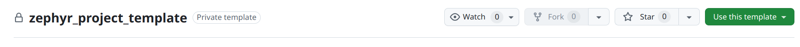

# Zephyr Module Template

This is a Zephyr Module Template and can be used as a starting point for developing any new Zephyr module.  To use as a template hit the **Use this template** button on github and then **Create a new repository** name the new Zephyr module in line with the existing modules, zephyr_module_name.



Configure the new repository with the same configurations and branch protection rules as the zephyr_module_template repo.

## Module Template Format

The following is a tree format of the Module Template repo:

```bash
tree zephyr_module_template/

zephyr_module_template/
├── CMakeLists.txt
├── drvr
│   ├── inc
│   │   ├── msgqTemplate.h
│   │   ├── template.h
│   │   ├── wdtTemplate.h
│   │   └── zbusTemplate.h
│   └── src
│       ├── msgqTemplate.c
│       ├── template.c
│       ├── wdtTemplate.c
│       └── zbusTemplate.c
├── host
│   └── hostTemplateTest.sh
├── Kconfig.template
├── mainTemplate.c
├── README.md
├── rename_module.sh
├── shell
│   └── src
│       └── shellTemplate.c
└── test
    ├── CMakeLists.txt
    ├── Kconfig
    ├── native_sim.overlay
    ├── prj.conf
    ├── src
    │   └── testTemplate.c
    └── testcase.yaml
```

It is broken up into **drvr**, **shell**, **host** & **test**.  This module template compiles successfully and demonstrates all the module features that are exposed.

### drvr/

This is the source code for the module driver itself

### shell/

This where the Module Zbus functionality is exposed to the Zephyr Shell.  It serves as a template for how to interact with the module from another module via Zbus.  It also serves as an interface to the module where we can read/write values that the module exposes to the Zbus.  It has a **test** feature that runs a live module self-test that can be used to query the operation of the module.  It also allows us develop a host script to automate the testing of all module in a project.

### host/

This is where scripts are added to automate testing of the module from the host pc via the exposed module shell interface.

### test/

This is the Unit Test component for automated testing of the module and integration to the CI/CD github workflow pipeline.  The upper level **zephyr_project_template** will automatically find all module tests and run them.

## Renaming the Template Files

Once the new repository is configured the first thing to do is rename the module files and text to match the new module name.  To do this first clone the repo to your local machine and run **rename_module.sh** script.  If you are renaming the module with a name that is greater than one word you need to separate the words with underscores.  The new module name should also be all lower case.  The script will manage updating all the files in the repo with the new module name.

Here we are renaming the new module to **button**

```bash
./rename_module.sh button

✅ Renamed: Kconfig.template ➝ Kconfig.button
✅ Renamed: mainTemplate.c ➝ mainButton.c
✅ Renamed: drvr/inc/template.h ➝ drvr/inc/button.h
✅ Renamed: drvr/src/template.c ➝ drvr/scr/button.c
✅ Renamed: drvr/inc/msgqTemplate.h ➝ drvr/inc/msgqButton.h
✅ Renamed: drvr/src/msgqTemplate.c ➝ drvr/src/msgq.c
✅ Renamed: drvr/inc/wdtTemplate.h ➝ drvr/inc/wdtButton.h
✅ Renamed: drvr/src/wdtTemplate.c ➝ drvr/src/wdtButton.c
✅ Renamed: drvr/inc/zbusTemplate.h ➝ drvr/inc/zbusButton.h
✅ Renamed: drvr/src/zbusTemplate.c ➝ drvr/src/zbusButton.c
✅ Renamed: host/hostTemplateTest.c ➝ host/hostButtonTest.c
✅ Renamed: shell/src/shellTemplate.c ➝ shell/src/shellButton.c
✅ Renamed: test/src/testTemplate.c ➝ test/src/Button.c
🔁 Replacing all occurrences of 'template.h' with 'button.h' (excluding .git)...
🔁 Replacing all occurrences of 'template.c' with 'button.c' (excluding .git)...
🔁 Replacing all occurrences of 'templateInit' with 'buttonInit' (excluding .git)...
🔁 Replacing all occurrences of 'templateMain' with 'buttonMain' (excluding .git)...
🔁 Replacing all occurrences of 'mainTemplate' with 'mainButton' (excluding .git)...
🔁 Replacing all occurrences of 'testTemplate' with 'testButton' (excluding .git)...
🔁 Replacing all occurrences of 'msgqTemplate' with 'msgqButton' (excluding .git)...
🔁 Replacing all occurrences of 'zbusTemplate' with 'zbusButton' (excluding .git)...
🔁 Replacing all occurrences of 'ZbusMsgTemplate' with 'ZbusMsgButton' (excluding .git)...
🔁 Replacing all occurrences of 'shellTemplate' with 'shellButton' (excluding .git)...
🔁 Replacing all occurrences of 'wdtTemplate' with 'wdtButton' (excluding .git)...
🔁 Replacing all occurrences of 'TEMPLATE*' with 'BUTTON*' (excluding .git)...
🔁 Replacing all occurrences of 'template_main*' with 'button_main*' (excluding .git)...
🔁 Replacing all occurrences of 'MsgqTemplate*' with 'MsgqButton*' (excluding .git)...
🔁 Replacing all occurrences of '.template*' with '.button*' (excluding .git)...
🔁 Replacing all occurrences of 'templateVal*' with 'buttonVal*' (excluding .git)...
🔁 Replacing all occurrences of 'templateMsg*' with 'buttonMsg*' (excluding .git)...
🔁 Replacing all occurrences of 'template_thread_lis*' with 'button_thread_lis*' (excluding .git)...
🔁 Replacing all occurrences of 'Template Commands*' with 'Button Commands*' (excluding .git)...
🔁 Replacing all occurrences of 'Test Template*' with 'Test Button*' (excluding .git)...
🔁 Replacing all occurrences of 'template*' with 'button*' (excluding .git)...
```

Now that new module is renamed you need to Open a Pull Request and update all the remote files with the changes.

## Developing the New Module

The new module is not setup for building/developing as a stand alone repo, instead it needs to be imported into the **zephyr_project_template** repo to start development, building and testing of the module.  For the guide on how to do that review the [**zephyr_project_template**](https://github.com/MistyWest/zephyr_project_template) readme.

## Coding Format

Most of the code formatting is handled by the clang_format file found in the project level repo so it is handled automatically.  Zephyr RTOS uses **snake_case_formatting** for all file, function, type and variable names.  In order to differentiate between Application code and Zephyr RTOS code the decision was made to use **lowerCamelCaseFormatting** for all file, function, type and variable names.  This should make it easier to deal with Zephyr RTOS function wrapping where we can use the same function name wrappers but the format is camelCase over snake_case.  It also makes it easy to see what is a Zephyr RTOS function and what is an Application function.

The format for **struct**, **enum**  will take the C++ style of capitalizing the first letter using UpperCamelCase

For struct this looks like:

```c
typedef struct {
    uint32_t val;
} ZbusMsg;

ZbusMsg zbusMsg;
```

For enum this looks like:

```c
typedef enum
{
    ENUM_VAL_00 = 0;
    ENUM_VAL_01;
    ENUM_VAL_02;
    ENUM_VAL_03;
    ENUM_VAL_COUNT
} EnumVal;
```
